# remete2
## Eremite (Remete2) is a ham radio remote site management and remote control system that employs standalone hosts and computer-based clients.

> This is a repository under construction!

The name and theme stem from a Hungarian play on words, based on the similarity between the words "remote" and "eremite" (hermit), which is "remete" in Hungarian. *These are just—hopefully—playful and amusing puns; they have nothing to do with any religious beliefs we may hold.* Earlier, we used the word "remete" to refer to both the microcontroller-based, remotely controlled server box equipped with relays and sensors, and the client software developed for Windows. Now, they have different names.

The first remote control that made it possible to use radios and antennas of our radio amateur (ham) club station from a remote location was developed by our oldest member, Karcsi (HA5BVK) and has been in excellent working order for a long time. The name "Remete" is his invention, and we still use it as a tribute to him. This is the reason why I also have taken the names of further elements of this system from that area.

As with the original "Remete-II" and "III" host and client, and my "Gatekeeper" ("Házmester") real-time power management and data acquisition firmware, the C/C++, Visual Basic, HTML, and CSS codes in these older projects were created manually. They were neither generated nor Vibe-coded. However, I used LLMs heavily in the newer ones to shorten the development and documentation time.

***
Components:
| Name                    | Description |
| ----------------------- | --------------------------------------------------------------------------------------------- |
| Gatekeeper (Házmester)  | 
A web-based real-time, multi-user and secure remote site management firmware and hardware using modern encryption and living communication channels (secure WebSockets). The Gatepeeker is an ESP32-S2 (now S3) board that is programmed using the ESP-IDF CLI environment, but a maintained Platformio.ini is available if needed.
 
This is the outermost circle nearest to the router that includes power management using opto-isolated relays, a mechanical safeguard against lightning damage, analog and digital data acquisition from environmental sensors, etc. (Its earlier version is called: The Bridge. It could only turn relays on and off, and its web page had to be manually refreshed.)
 
The first version of this controller was developed remotely instead of in our radio club (HG5C, Gyömrő) and worked successfully at the home of a fellow ham radio operator, OM5XX, in Komarno, Slovakia. Sadly, he passed away in February 2026. Rest in peace, Johnny.
 

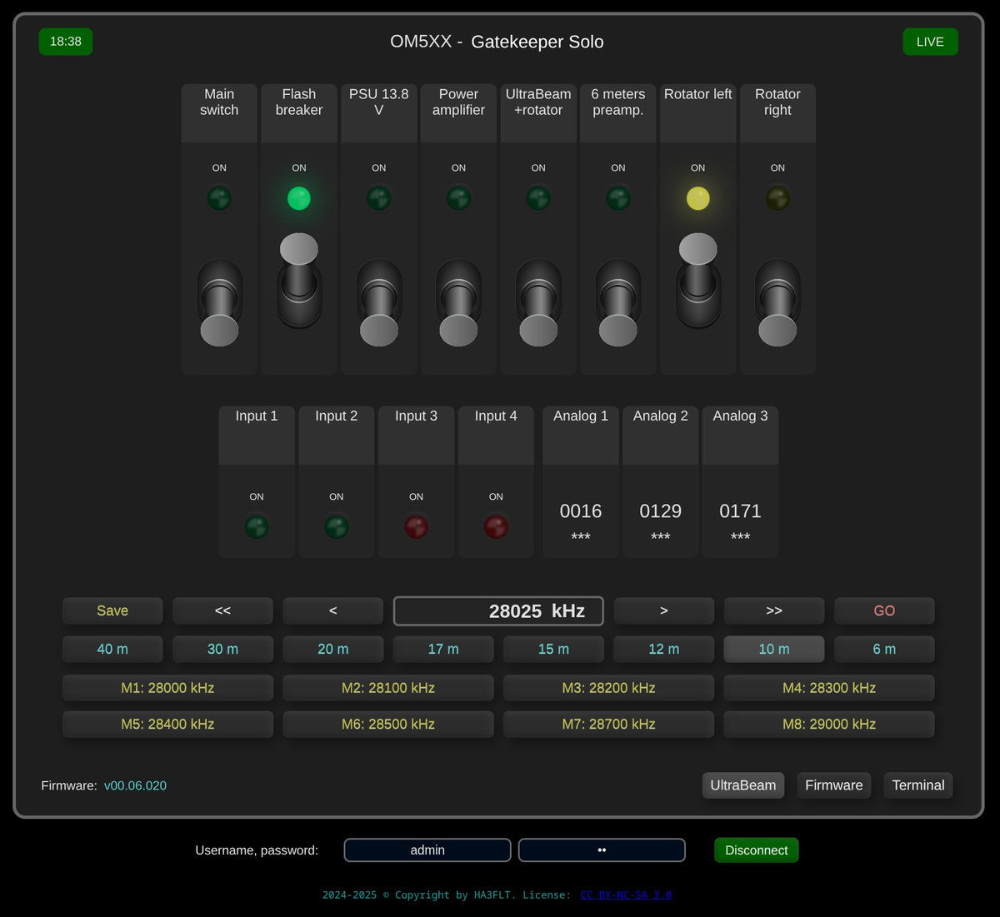   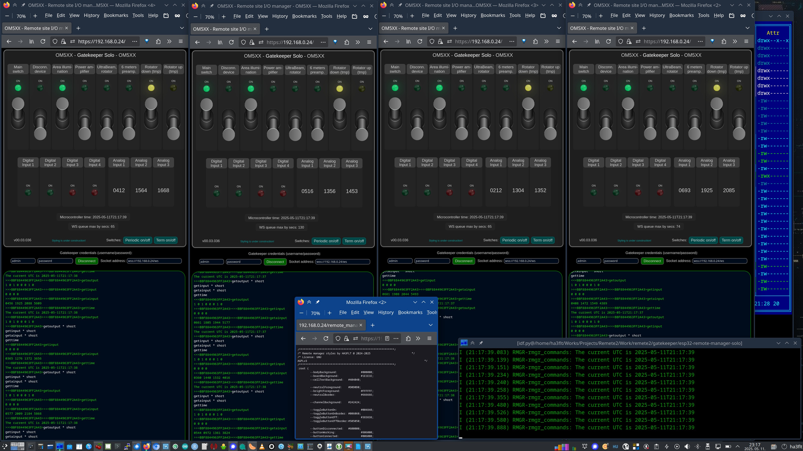 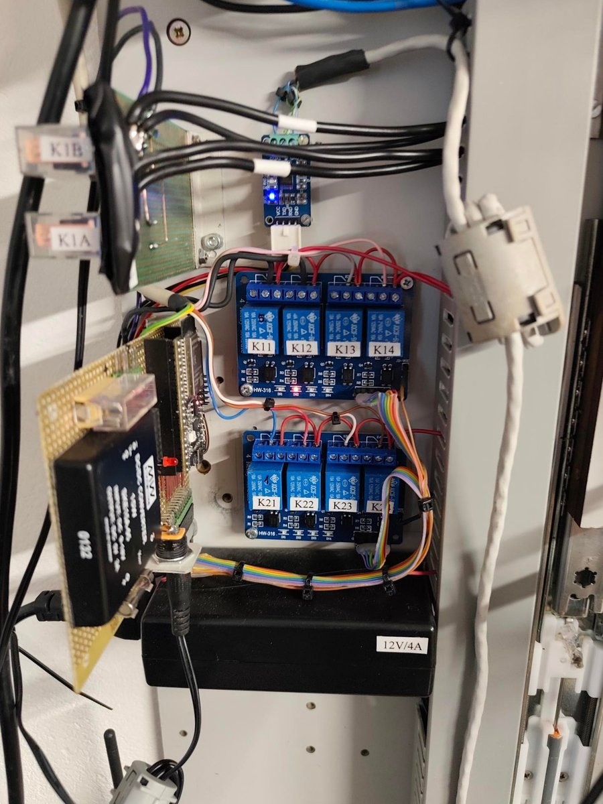 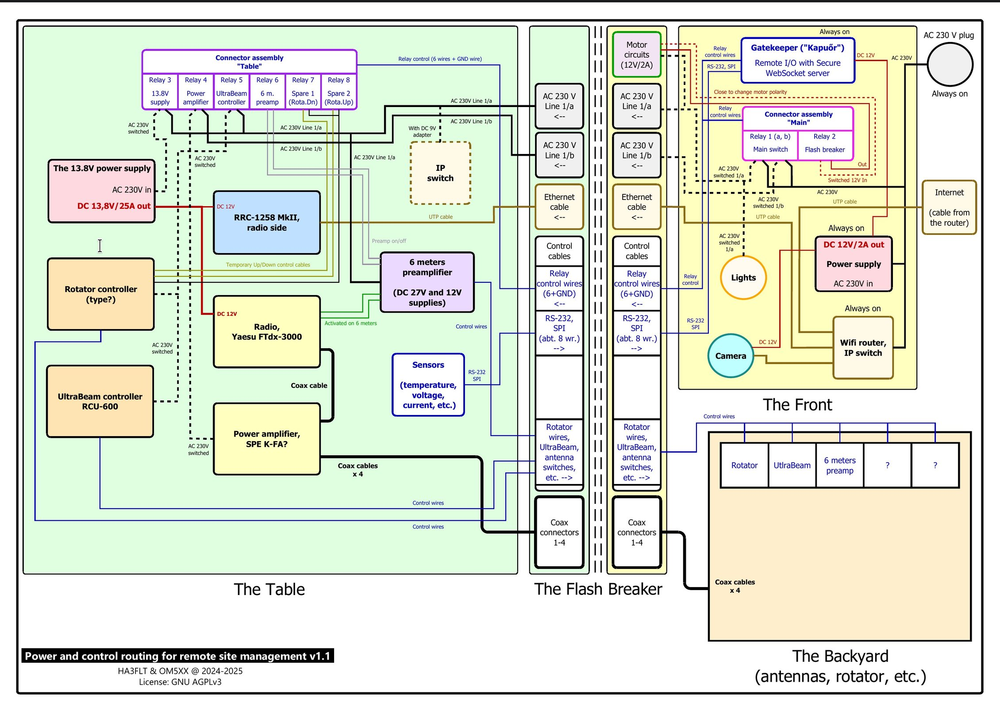 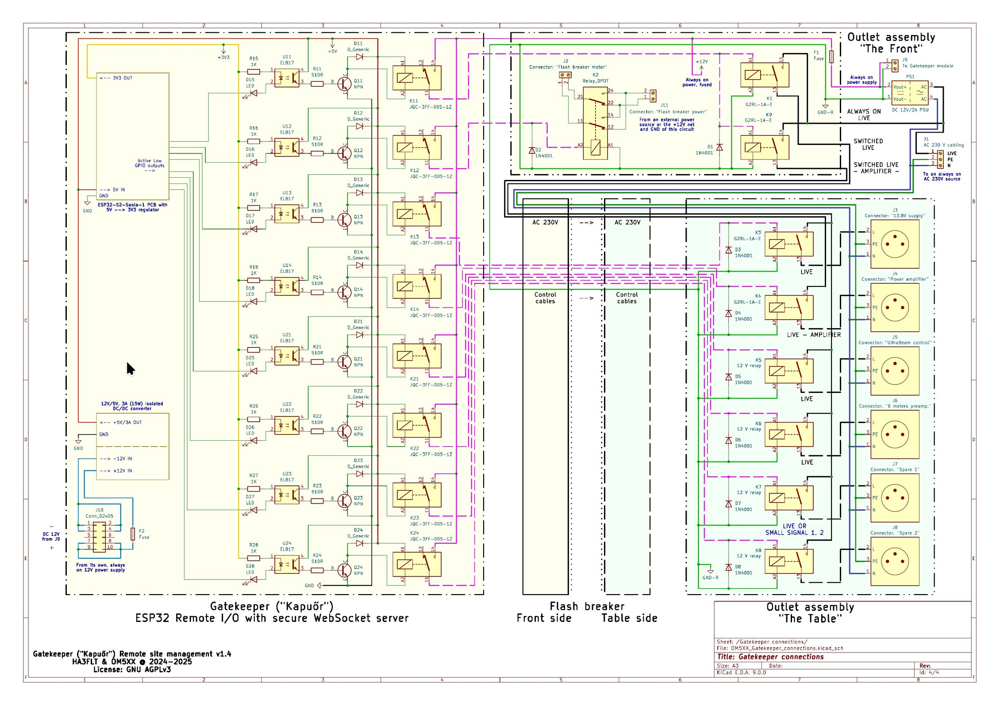
 |
| <blockquote>"The Bridge"</blockquote> | 
<blockquote>
The old web-based relay remote switching application (the ESP32 board on the photo with eight relays) developed by our member, Ervin (HA2OS). Essentially, it is an example from the development tools of an old ESP32 board. It was urgent to get it working at that time, and it remained in service for a long time.
 
Although it is neither real-time nor secure, it was a project that could be completed in a few days many years ago and has worked flawlessly ever since. However, its static nature poses a risk in a multi-user environment because it does not update the data on the client-side data based on events, such as when someone else turning a channel on or off.
 
I mitigated most of the risk a few years ago by designing a special workflow within the client application. This workflow assumes that everyone uses our extended "Remete" application instead of a web browser. It is only partially documented here.
</blockquote> 

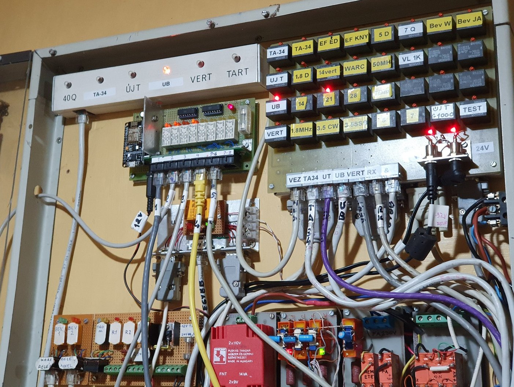 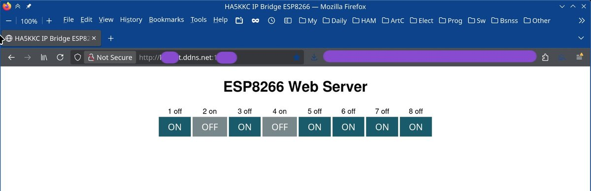
 |
| <blockquote>"Remete-II/III"</blockquote> | <blockquote>
This is the old system developed by our eldest member, Karcsi (HA5BVK). It consists of a server box that containing a TCP/IP-capable PIC, numerous opto-isolated SPI I/O chips for the relay matrix of our antenna system, tunneled RS-232 connections, and analog inputs from the antenna rotators.
 
The client side is a Visual Basic 6 application, so I always get a chance to feel nostalgic when I'm working on it. Since we don't have time to document a system that is already up and running, that we won't further develop, but rather replace, only partial information about these units and their communication is provided here.
</blockquote> 
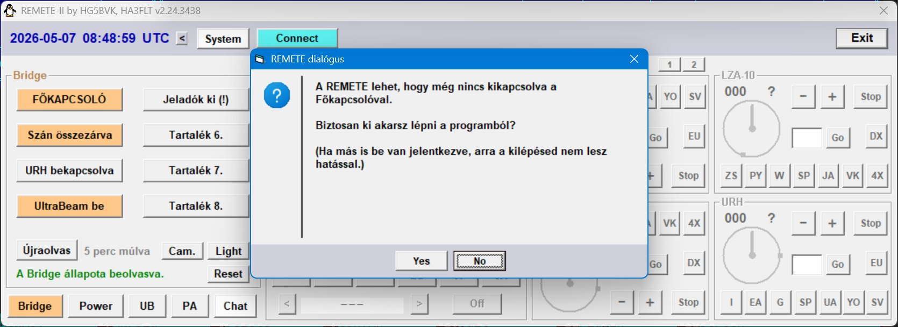 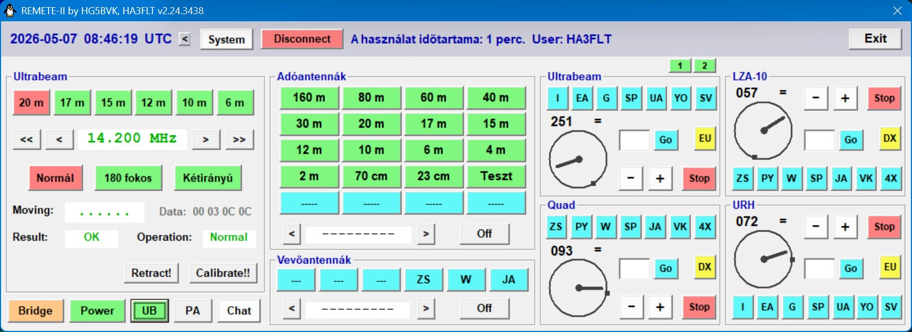 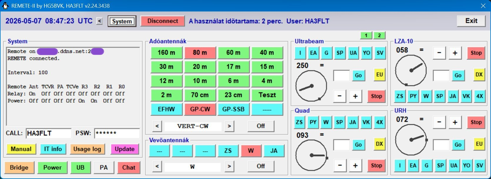 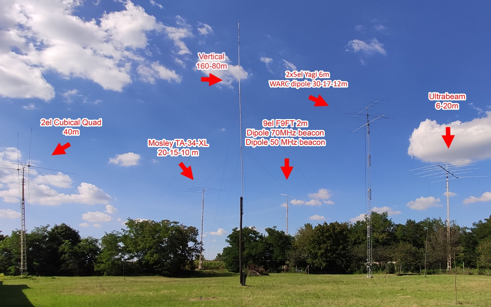 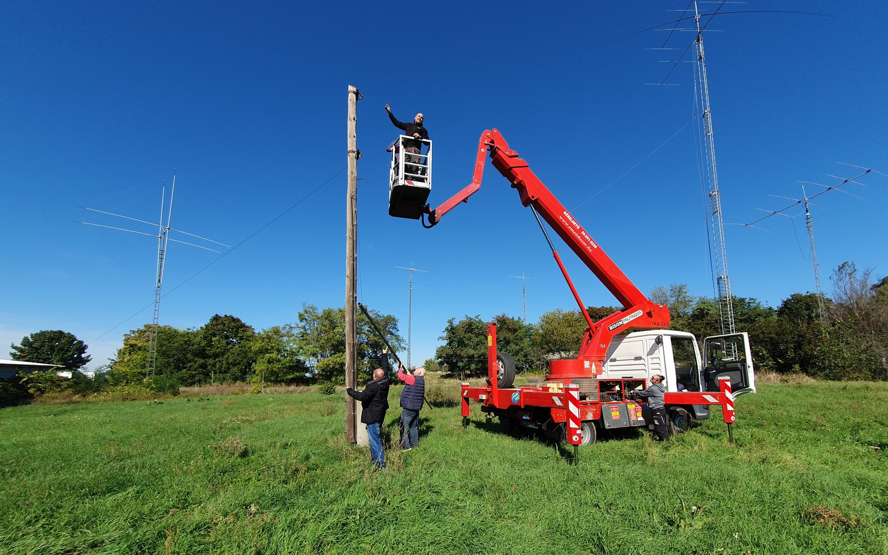 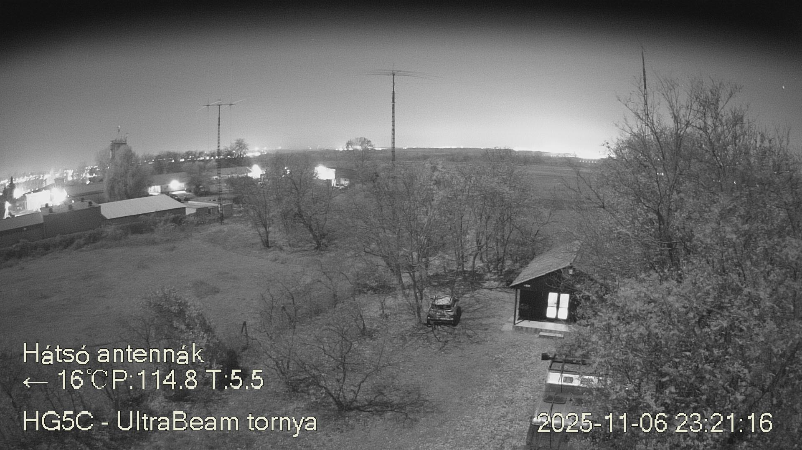
 <blockquote>The following photos were taken at my home after a lightning strike occurred despite all the precautions that had been taken at the time. I had to replace half of the optocouplers and the SPI bus I/O circuits, not to mention the PIC itself.</blockquote> 
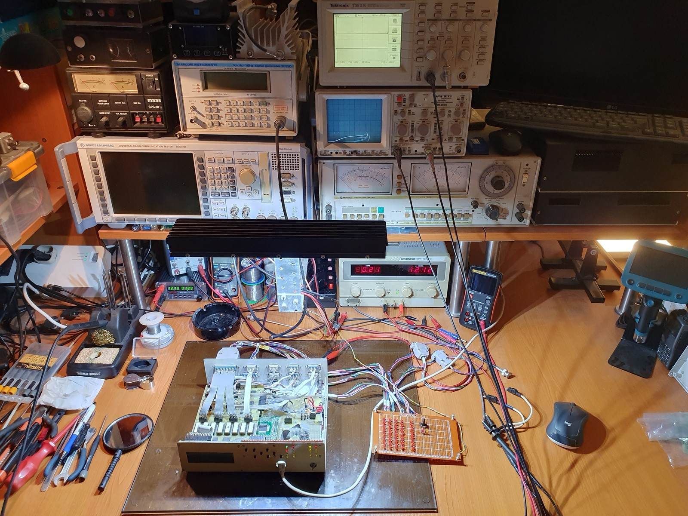 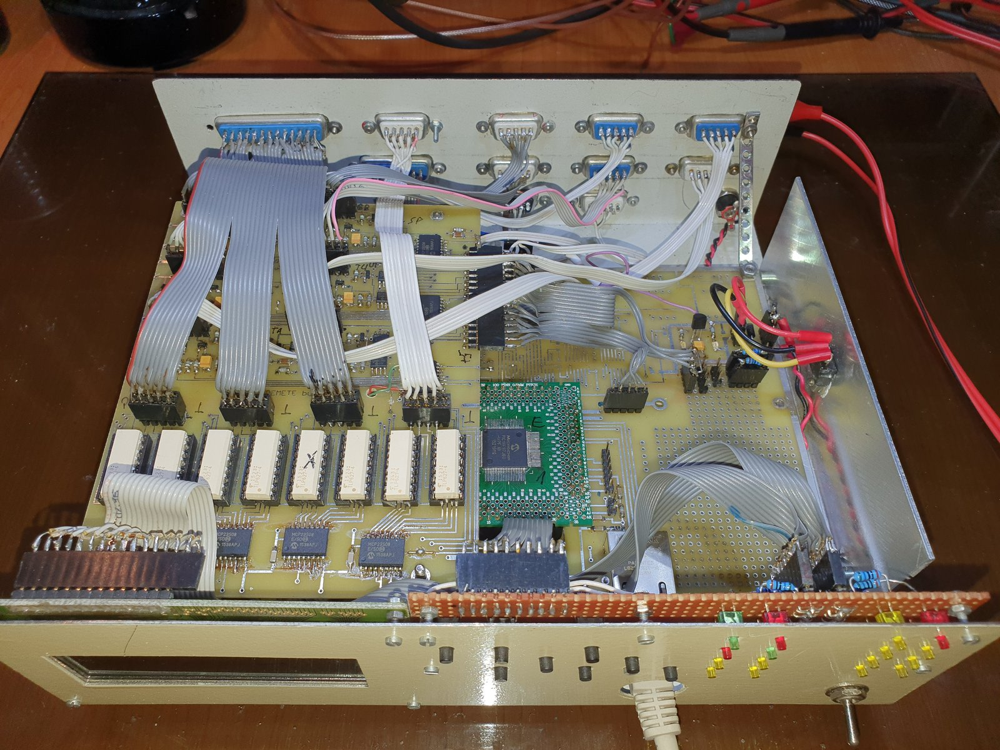 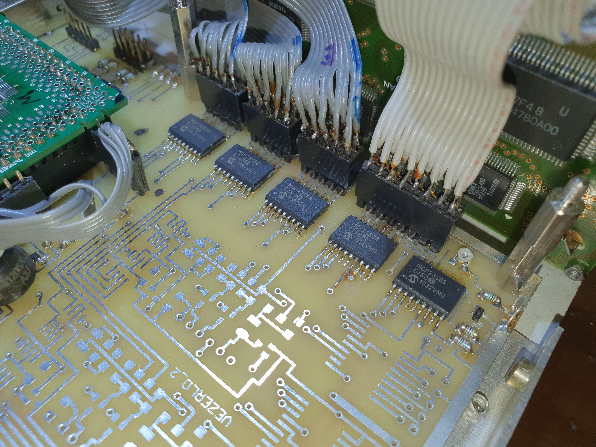
 |
| Eremite (Remete2)       | The host side of the future remote control system. A standalone host, a box and its hardware and firmware for the above mentioned radios, antennas, rotators, etc.), the namegiver. |
| Friar (Szőrzetes)       | Complete client-side solution for the host above, multi-platform software and optionally some hardware as well, perhaps for physical controls attached to the clients' computers. This will be the new system, which is in the planning phase in case the old one becomes obsolete or is no longer maintainable for any reason. |
| <ul><li>Intermediary</li></ul> | <ul><li>Eremite (Remete2) client service. Part of the Friar.</li></ul> |
| <ul><li>Visionary</li></ul> | <ul><li>Eremite (Remete2) client UI applications. Part of the Friar.</li></ul> |

Public documentation can be found at: https://github.com/ha3flt/remete2/wiki/

***

Created by **HA3FLT**
